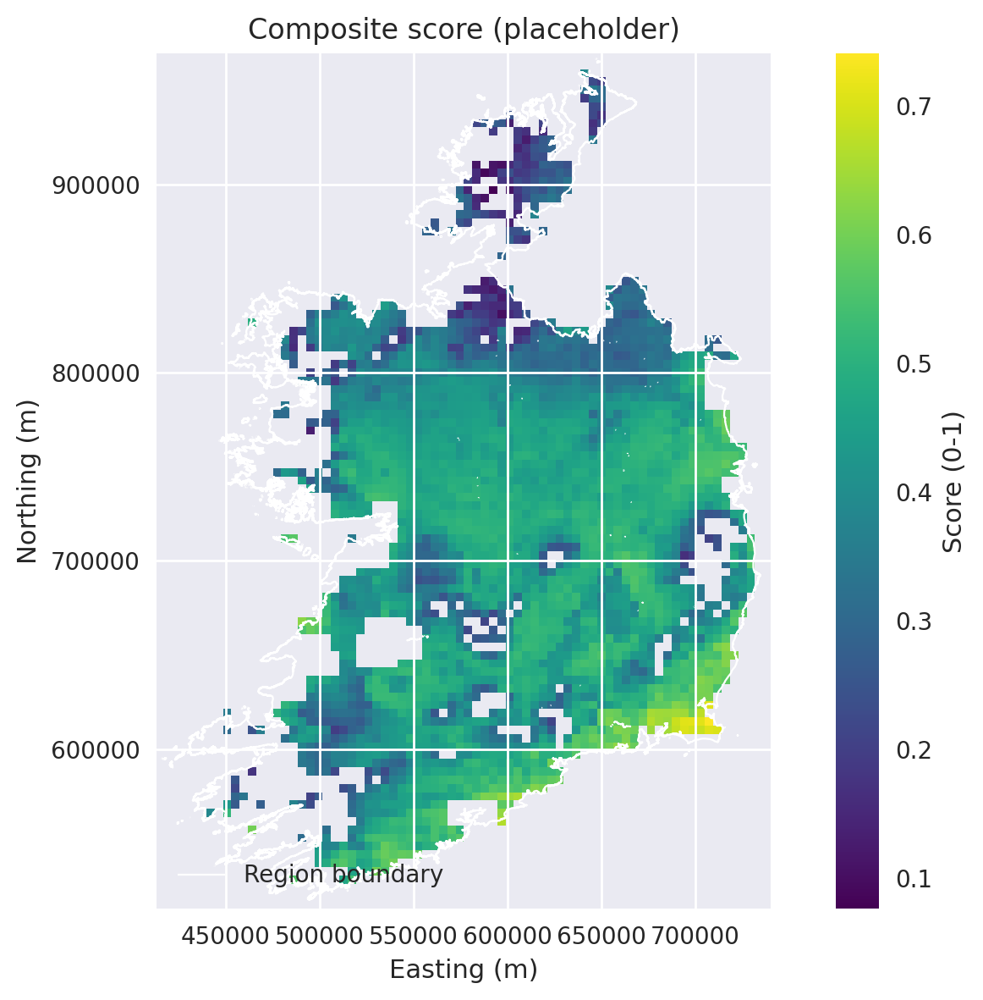

# Coarse-Grid Renewable Siting Prototype (Ireland)

This repository hosts a lightweight, reproducible prototype for renewable siting on a coarse (~4.4 km) PVGIS grid over Ireland. It is aimed at reviewers and energy-system modellers who want to see a transparent, geospatial feature pipeline that could later feed ETHOS-style workflows. The notebooks illustrate how DEM/irradiance/land-cover layers are aligned, summarised, and combined into a placeholder score. Everything here is intentionally simple and exploratory—this is not a finalized planning tool.

Current functionality includes:
- DEM and irradiance preprocessing to a common CRS/resolution.
- Derived slope and distance-to-infrastructure features on the same grid.
- Simple rule-based siting filters (slope, irradiance, land-cover, etc.).
- A placeholder multi-criteria score on the grid.
- Reviewer-friendly notebooks with QA tables, histograms, and spatial maps.

Next steps (not yet implemented):
- Cost-based calibration of scores.
- Improved land-use and protected-area constraints.
- Integration with full energy system models or ML-based siting.

Weights and thresholds in the current score are illustrative and not calibrated to real cost data; adjust them cautiously for scenario experiments.

## Example map

Composite placeholder score on the coarse PVGIS grid (higher = more suitable); derived from aligned irradiance, slope, and land-cover layers.

## Data and structure (lightweight)
- Inputs (user-supplied): PVGIS SARAH irradiance raster (~4.4 km), DEM for Ireland, OSM extracts for roads/power lines, land-cover raster, and `region_boundary.geojson`.
- Outputs: aligned rasters in `data/interim/`, placeholder score in `data/processed/score_placeholder.tif`, and exported figures in `figures/`.
- Code: preprocessing helpers in `src/`, stepwise scripts in `scripts/`, exploratory notebooks in `notebooks/`, and documentation in `docs/`.
