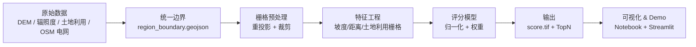
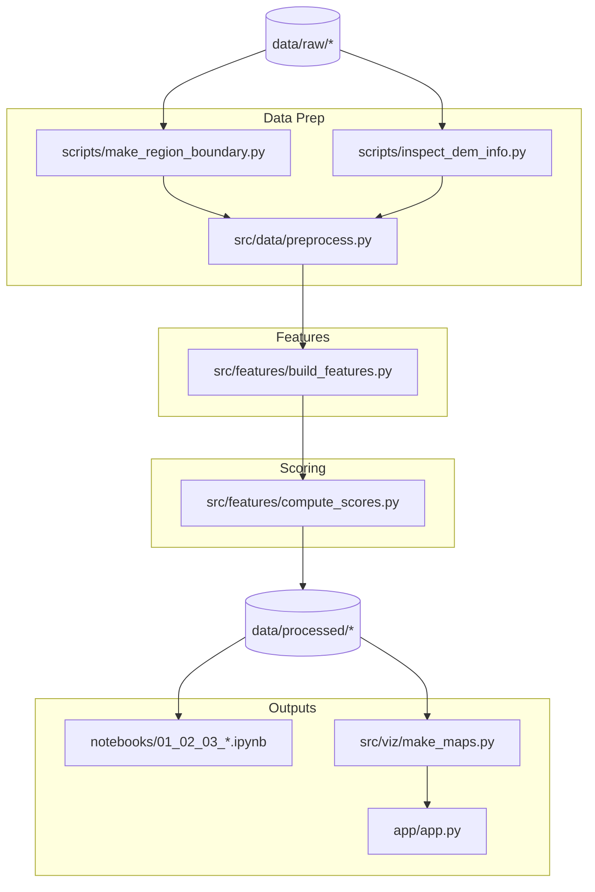

# 架构概览

目前文档规模不大，概念层与实现层的关系紧密，放在一个文件里更方便同步维护，因此暂不拆分成两个 md（后续若 Web/App 与数据处理演进出更多职责，再按层拆分）。

## 概念层（业务流程）

## 实现层（代码与文件）

> **关联说明**：
> - `scripts/*` 负责一次性/独立的准备工作，例如 dissolve 边界、检查 DEM。
> - `src/data/preprocess.py` 提供可复用函数（读取边界、重投影、裁剪）供 notebooks 与 pipeline 共享。
> - `src/features/*` 以预处理产物为输入，生成特征与最后的评分。
> - `notebooks`、`src/viz`、`app/app.py` 共享评分结果进行可视化与交互展示。
