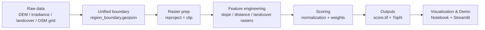
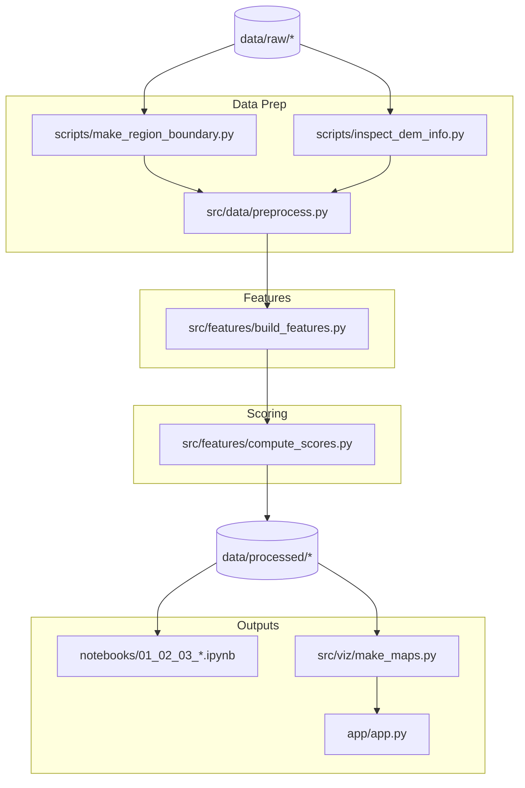

# Architecture Overview

Docs are small, so concept and implementation live together here; we can split later if Web/App diverges.

## Concept (business flow)

## Implementation (code & files)

**Notes**:
- `scripts/*` handle one-off prep (e.g., dissolve boundary, inspect DEM).
- `src/data/preprocess.py` offers reusable helpers (load boundary, reproject, clip) for notebooks/pipelines.
- `src/features/*` consume preprocessed rasters to produce features and scores.
- `notebooks`, `src/viz`, `app/app.py` visualize and interact with scoring outputs.
